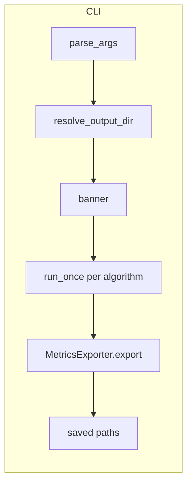

# Terminal execution guide

This document explains **what runs when you start the simulator from the terminal**: entry points, CLI flags, modules involved, simulation concepts, and what each line of output means.

---

## How you start the program

Typical invocations:

```bash
python src/cli/main.py --dataset path/to/sample.csv --algorithm all
python -m src.cli.main --dataset path/to/sample.csv --algorithm rr --sample 5000
```

Both paths load `src/cli/main.py`. The script adjusts `sys.path` so imports like `src.balancer` resolve when the project root is not installed as a package.

**Bootstrap details**

- **`PROJECT_ROOT`**: The directory two levels above `main.py` (the repository root). If it is not already on `sys.path`, it is inserted so `from src....` imports work.
- **`Console` (Rich)**: Pretty-printed terminal output (colors, alignment). Used for the banner and final summary lines.
- **Relative import guard**: `LiveDashboard` is imported from `.live_dashboard` when run as a module, or `live_dashboard` when run as a plain script—same file, two valid launch styles.

---

## Command-line arguments (`parse_args`)

| Flag | Meaning |
|------|---------|
| `--dataset` | Path to the cleaned CSV the simulator reads. Default in code: `dataset/archive/ecommerce_sample.csv`. |
| `--algorithm` | One of `rr`, `wrr`, `lc`, `ip_hash`, or `all` (runs every algorithm in sequence). |
| `--speed` | **Replay pacing**. `0` = no sleeping between rows (maximum throughput). Any positive value scales real-time delays: the replayer sleeps `arrival_delta_s / speed` between requests. |
| `--sample` | If `> 0`, cap how many rows are processed after filtering; `0` means process everything the loader yields. |
| `--exclude-bots` | If set, rows with `is_bot=True` are dropped when loading (requires an `is_bot` column). |
| `--seed` | Seed for Python’s `random.Random`, so simulated service times stay reproducible. |
| `--output` | Controls where exported reports go; see **Output directory resolution** below. |
| `--queue-capacity` | Max simultaneous **in-flight** requests **per node** in the simulation. `0` or negative = unbounded. |

---

## High-level execution flow (`main`)

1. **Parse arguments** and normalize the algorithm list (`all` → `["rr", "wrr", "lc", "ip_hash"]`).
2. **`resolve_output_dir`**: Compute the folder tree under `results/` (unless you pass an explicit path). See below.
3. **Print the banner**: Dataset path, algorithms, speed, sample size, bot policy, queue cap, seed—so the terminal session records the run configuration.
4. **For each algorithm**, call `run_once(...)`, which drives the full simulation and live UI for that algorithm.
5. **`MetricsExporter.export`**: Writes JSON summary, text summary, charts (when plotting libraries succeed), and HTML pages under a timestamped `runs/` subdirectory.
6. **Print saved paths** for the JSON report, TXT summary, and HTML directory when applicable.



---

## Output directory resolution (`resolve_output_dir`)

Behavior depends on `--output`:

- **Empty, `results`, or `.`**: Use a **classified layout**:

  `results/<dataset_stem>/algorithms_<label>/sample_<N|all>/queue_<cap|unbounded>/bots_<with_bots|no_bots>/`

  where `<label>` is the single algorithm name or `all` when multiple algorithms run.

- **Absolute path**: Use it as the export root directly.
- **Starts with `results/` or `results\`**: Strip the prefix and place under `results/`.
- **Starts with `results_`**: Strip that prefix and append under `results/`.
- **Anything else**: `results/<your_string>/`.

Inside that resolved directory, `MetricsExporter` always creates `runs/<timestamp>/` with `reports/`, `charts/`, and `html/` subfolders for that run.

---

## One full simulation pass (`run_once`)

`run_once` is the **core event loop**. For one balancing algorithm it:

1. Builds **`DatasetLoader`** → **`TrafficReplayer`** → **`NodePool`** (with **`Node`** instances) → **`get_algorithm(...)`** → **`MetricsCollector`**.
2. Starts **`HostRuntimeSampler`** (CPU/RAM sampling via `psutil` when available).
3. Opens **`LiveDashboard`** as a context manager (Rich **Live** UI while requests stream).
4. Iterates **`for req, sim_second in replayer.replay()`** and, each iteration:
   - Optionally samples host metrics.
   - **Flushes completions** scheduled up to `sim_second` (see **Completion heap**).
   - **`pool.tick(sim_second)`**: applies scheduled node failures/recoveries.
   - Updates dashboard health from each node’s `is_healthy`.
   - **`algo.select_node(req, pool.nodes)`**: picks a backend (may skip unhealthy nodes depending on algorithm).
   - **Queue / backpressure**: If the chosen node has too many `in_flight` requests vs `--queue-capacity`, the simulator tries another healthy node with capacity; if none, the request is **dropped**.
   - **Failover flag**: Set when sticky routing (`ip_hash`) had to avoid an unhealthy ideal node, or when the selected node ID differs from the first pick after rerouting logic.
   - **Cache simulation**: For cacheable URLs, `node.check_cache` may count a cache hit (path-based set per node).
   - **`node.process`**: Draws a random **service time** in milliseconds, scaled by `request_weight`.
   - **Queue wait**: Derived from `node.next_available_s` vs current `sim_second` (serialized processing per node in simulated time).
   - Pushes a **`CompletionEvent`** onto a **min-heap** keyed by `complete_at_s`.
   - **`dash.tick(...)`**: refreshes live panels with counters and the current request snippet.

After the stream ends, **`flush_completions(∞)`** drains remaining events. The sampler **`flush`** runs, **`metrics.summary()`** aggregates stats, wall-clock time is recorded, and **`host_runtime`** is merged into the summary dict.

---

## Components (modules and roles)

### `DatasetLoader` (`src/ingestion/loader.py`)

- **Reads the CSV in chunks** (`chunksize`, default 200k rows) for memory efficiency.
- **Normalizes** rows into **`Request`** objects (`src/ingestion/models.py`): timestamps, client identifiers, HTTP metadata, bytes, weights, bot flag, etc.
- **`exclude_bots`**: Filters chunks before conversion when enabled.
- **`sample_size`**: Limits total yielded requests across chunks.

**Terms**

- **`Request`**: One logical HTTP request in the simulation (not a real socket).
- **`arrival_delta_s`**: Time gap from the previous row’s timestamp used to advance **simulated time** (`sim_second`).
- **`request_weight`**: Multiplier applied to randomized service latency (heavier/slower requests).
- **`client_hash`**: Integer derived from client identity; used by **`ip_hash`** for affinity.
- **`is_cacheable`**: Heuristic (static extensions, no query string / “filter” in path) used only for the optional cache stats path.

### `TrafficReplayer` (`src/replayer/replayer.py`)

- Streams **`(Request, sim_second)`** pairs.
- **`replay_speed`**: When `> 0`, inserts **`time.sleep(delta / speed)`** so wall-clock replay can mimic compressed or real-time traffic; **`0`** skips sleep for maximum throughput.

### `Node` (`src/nodes/node.py`)

- **`weight`**: Used by weighted round-robin (`wrr`).
- **`latency_min_ms` / `latency_max_ms`**: Bounds for **`process()`** uniform random service time × **`request_weight`**.
- **`is_healthy`**: Whether the load balancer should treat the node as up (`NodePool` toggles this on failure schedule).
- **`next_available_s`**: End of the simulated busy interval on this node (serialization).
- **`in_flight`**: Count of requests accepted but not yet completed (used for **least connections**, queue caps, dashboard).
- **`check_cache`**: Per-node path set; first sighting misses, repeat paths “hit” for metrics.

### `NodePool` (`src/nodes/pool.py`)

- Holds **`FailureEvent`** entries. **`schedule_failure`** registers **`node_id`**, **`at_second`**, **`duration_s`**.
- **`tick(sim_second)`**: Marks nodes unhealthy when failure starts, healthy again after duration.
- **Built-in demo**: `build_node_pool` schedules **`node-1`** down from **120s** for **30s** simulated seconds.

### Load balancer algorithms (`src/balancer/`)

All implement **`LoadBalancer`**: `select_node(request, nodes)`, `on_complete(node_id, latency_ms)`, plus hooks like **`on_failure`** where implemented.

| Key | Class | Idea |
|-----|--------|------|
| `rr` | Round-robin | Rotate among healthy nodes. |
| `wrr` | Weighted round-robin | Health-aware weighted rotation. |
| `lc` | Least connections | Prefer healthy node with smallest **`in_flight`** (updated as completions flush). |
| `ip_hash` | IP hash | Map **`client_hash % N`** to a node; unhealthy ideal node implies **failover** to another healthy node. |

### `MetricsCollector` (`src/metrics/collector.py`)

Records per-request latencies, queue vs service breakdown, drops, reroutes, failovers, bot vs human counts, per-second RPS buckets, per-node stats, cache hits. **`summary()`** returns percentiles (p50/p95/p99), **`load_imbalance_score`** (standard deviation of per-node request counts), error/drop rates, etc.

### `HostRuntimeSampler` (`src/metrics/host_runtime.py`)

Samples **this Python process** and **system memory** periodically (`sample_interval_s`, default 0.25s) via **`psutil`**. If `psutil` is missing, host metrics are marked unavailable. Aggregates **mean/min/max** for CPU and RSS into **`host_runtime`** inside the run summary.

### `LiveDashboard` (`src/cli/live_dashboard.py`)

Uses Rich **`Live`**, **`Layout`**, **`Table`**, **`Panel`** to redraw a multi-panel terminal UI at **`REFRESH_HZ`** (about 8 Hz). Shows node health, in-flight counts, cumulative counters (drops, reroutes, failovers, cache hits), rolling latency sparkline-style views, and the **current** request fields where wired from `dash.tick`.

### `MetricsExporter` (`src/metrics/exporter.py`)

Writes under **`runs/<timestamp>/`**:

- **`reports/`**: JSON benchmark report; TXT human-readable summary table.
- **`charts/`**: PNG plots when matplotlib/seaborn succeed (distribution, latency comparison, imbalance).
- **`html/`**: Static HTML overview and per-node pages.

Returns a dict of **`Path`** objects printed at the end of **`main`**.

---

## Important simulation terms

| Term | Meaning |
|------|---------|
| **Simulated second (`sim_second`)** | Logical timeline advanced by CSV **arrival deltas**, not necessarily equal to wall-clock seconds unless `--speed` is tuned that way. |
| **Completion heap (`in_flight` list)** | Min-heap of **`(complete_at_s, seq, CompletionEvent)`** so completions fire in time order when **`flush_completions`** runs. |
| **Dispatched** | Loop iterations counting streamed requests; drops still increment **dispatched** in the main loop counter (`dispatched_count`) before `continue`. |
| **Dropped request** | No healthy/alternative node had queue capacity; **`metrics.record_drop`** runs; no completion event is scheduled. |
| **Backpressure reroute** | Primary pick had full queue; another node with capacity handled the request instead. |
| **Failover (metric flag)** | Logical departure from ideal routing (e.g. unhealthy sticky target) or path changed because of rerouting—see `run_once` for exact conditions. |
| **Total latency** | **`queue_wait_ms + service_latency_ms`** stored on the request as **`simulated_latency_ms`**. |
| **Wall time vs sim time** | **`time.perf_counter()`** measures real runtime for throughput (**req/s** line); **`sim_second`** drives ordering and failure windows inside the model. |

---

## What you see in the terminal

1. **Separator banner**: Confirms configuration (dataset, algorithms, speed, sample, bots, queue cap, seed).
2. **Per-algorithm section**: `Running: RR | dataset: …` then a rule line.
3. **Live dashboard**: Full-screen Rich layout while requests replay (may resize/reflow based on terminal width).
4. **Completion line** (after each algorithm): `Done: N requests in X.XXs | p99=…ms | imbalance=… | Y req/s` — uses **wall-clock** duration and **`metrics.summary()`** aggregates.
5. **Host line** (when samples exist): Mean/max CPU, RSS, system RAM usage from **`HostRuntimeSampler`**.
6. **Export lines**: Paths to **`benchmark_report_*.json`**, **`benchmark_summary_*.txt`**, and **`html/`** directory.

---

## Files to read next

- **Orchestration**: `src/cli/main.py`
- **Interactive UI**: `src/cli/live_dashboard.py`
- **Data model**: `src/ingestion/models.py`, `src/ingestion/loader.py`
- **Simulation loop driver**: `src/replayer/replayer.py`
- **Balancing policies**: `src/balancer/*.py`
- **Exports**: `src/metrics/exporter.py`

This simulator is **offline**: it does not open network listeners; “nodes” are Python objects with timed behavior, and the terminal shows **telemetry and reports** from that discrete-event style loop.
